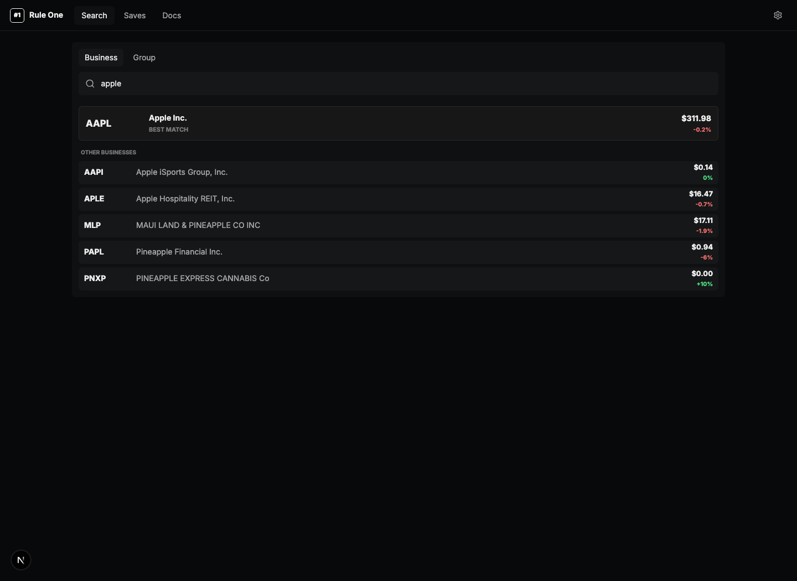
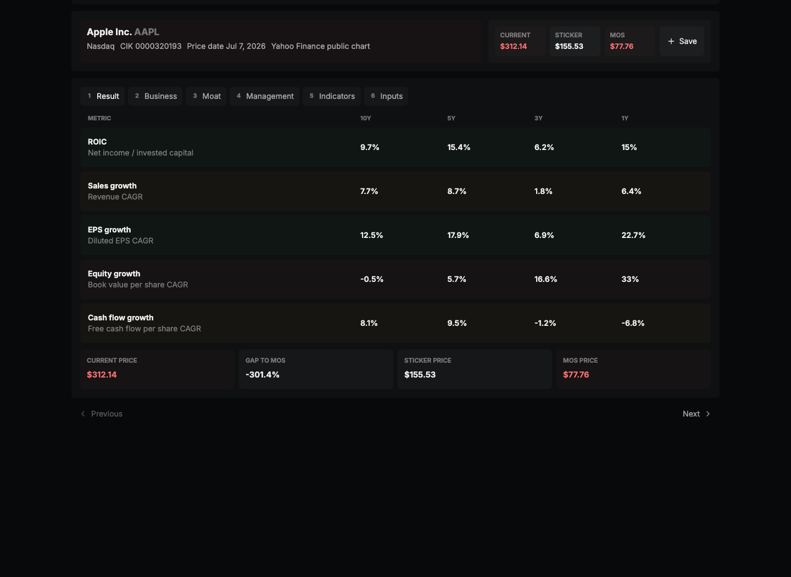
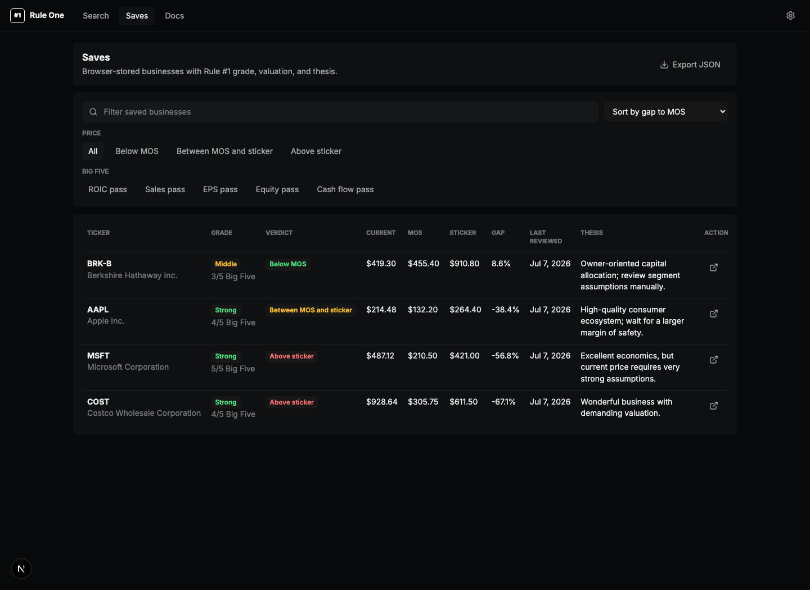
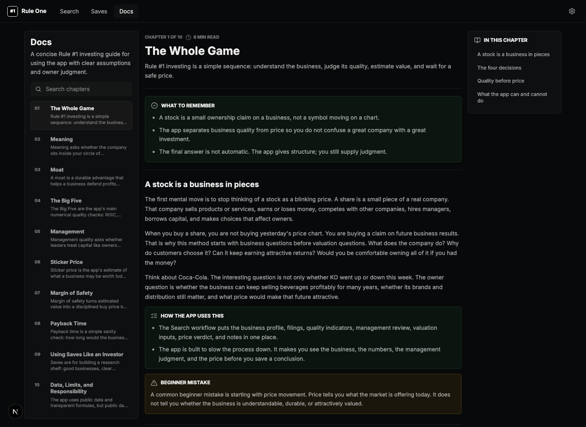

# Rule One Portfolio

Rule One Portfolio is a local-first investing research app for evaluating U.S. public businesses with Rule #1-style valuation.

Most investing workflows scatter the important pieces across screeners, filings, calculators, notes, and spreadsheets. This app puts the core research loop in one place: business search, Big Five quality metrics, technical indicators, sticker price, margin of safety, payback-style valuation, moat and management notes, filings, assumptions, and saved research.

It is designed for disciplined research, not trade recommendations. You can evaluate one company deeply or run a screen across many businesses, then save the ones worth revisiting.



## Why It Is Useful

Investing work gets harder when every business has to be rebuilt from scratch. Rule One Portfolio keeps the workflow consistent:

- Search a U.S. public company by ticker or name.
- Review the Big Five in one table: ROIC, sales growth, EPS growth, equity growth, and cash-flow growth.
- Compare current price, sticker price, and margin-of-safety price.
- Inspect technical indicators beside the fundamental valuation work.
- Read moat and management briefs generated from public source material.
- Open SEC filings and source links when the numbers need checking.
- Save businesses locally with notes, assumptions, grades, and valuation results.
- Run group screens, for example against the S&P 500 or a sector, to compare many businesses with the same method.

The goal is not to replace judgment. The goal is to make the assumptions and evidence visible enough that judgment gets better.

## Screenshots

| Search | Apple Result |
| --- | --- |
|  |  |

| Saves | Docs |
| --- | --- |
|  |  |

## Features

- Unauthenticated Next.js app.
- Browser-local saves and workspace export.
- U.S. company search using public company data.
- SEC EDGAR-backed company profiles, filings, submissions, and company facts where available.
- End-of-day price history from free public sources.
- Big Five analysis across 10-year, 5-year, 3-year, and 1-year windows where data supports it.
- Rule #1-style valuation inputs:
  - current or TTM EPS
  - growth assumption
  - future PE assumption
  - required return
  - time horizon
  - sticker price
  - margin-of-safety price
- Payback-style valuation view when earnings data supports it.
- Moat and management briefs generated offline and committed as JSON.
- Technical indicators including MACD, stochastic oscillator, and moving averages.
- Local notes and manual assumptions.
- Group screening for comparing many businesses with the same framework.
- Built-in docs that explain the investing method, formulas, assumptions, and limitations.

## Data Sources

The app is built around free public data:

- SEC EDGAR company tickers, submissions, filings, and company facts.
- Free end-of-day price data where available.
- Offline qualitative fact packets and briefs based on public source material.
- Editable user assumptions for cases where free data is missing, delayed, or ambiguous.

Best support is for U.S.-listed companies with SEC filings. International companies, thinly traded securities, financial institutions, recent IPOs, and businesses with unusual accounting can require extra manual review.

## Getting Started

Install dependencies:

```bash
pnpm install
```

Run the development server:

```bash
pnpm dev
```

Open [http://localhost:3000](http://localhost:3000).

Run local checks:

```bash
pnpm lint
pnpm typecheck
pnpm test
pnpm build
```

## Environment

The app can run without API keys for the core local workflow. Optional environment variables are documented in [.env.example](.env.example).

For SEC requests, set a real contact in `SEC_USER_AGENT` before running heavily:

```bash
SEC_USER_AGENT="RuleOnePortfolio/0.1 contact: you@example.com"
```

Qualitative brief generation is a local/offline maintenance workflow. The app does not call OpenAI at runtime. See [docs/05-qualitative-generation.md](docs/05-qualitative-generation.md).

## Project Structure

- [src/app](src/app) - Next.js routes and API routes.
- [src/components](src/components) - Search, saves, docs, and shared UI.
- [src/lib](src/lib) - Rule #1 calculations, data adapters, indicators, formatting, storage, and docs content.
- [src/lib/data/qualitative](src/lib/data/qualitative) - committed qualitative fact packets and briefs.
- [docs](docs) - product, method, data, UX, roadmap, and generation notes.
- [scripts/qualitative](scripts/qualitative) - local qualitative data generation utilities.

## Open-Source Status

This project is open source under the MIT License. Contributions are welcome, especially around data quality, source attribution, formulas, documentation, accessibility, and manual test coverage.

See [CONTRIBUTING.md](CONTRIBUTING.md) and [SECURITY.md](SECURITY.md).

## Disclaimer

Rule One Portfolio is an educational research tool. It is not financial advice, investment advice, a recommendation engine, a broker, a trading terminal, or a promise of investment returns.

The app does not know your goals, taxes, time horizon, risk tolerance, portfolio, income needs, legal restrictions, or personal circumstances. Any investment decisions are your own.

This project is inspired by publicly available Rule #1 investing concepts popularized by Phil Town. It is not affiliated with Phil Town, Rule #1 Investing, the SEC, Stooq, OpenAI, Z.ai, or any data provider.

Public data can be incomplete, delayed, normalized incorrectly, or unsuitable for a specific business. Always review original filings and source material before relying on a metric or valuation.
